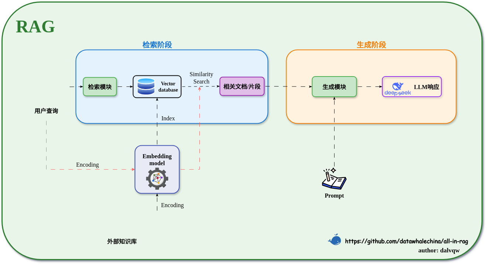
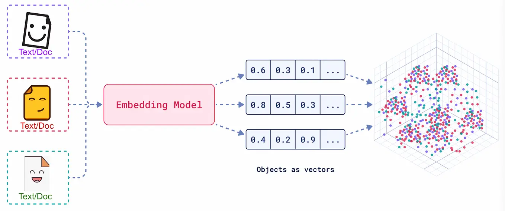
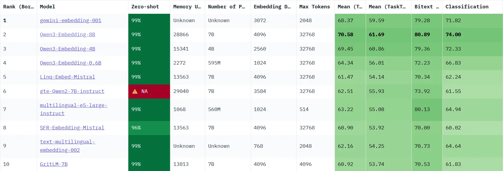
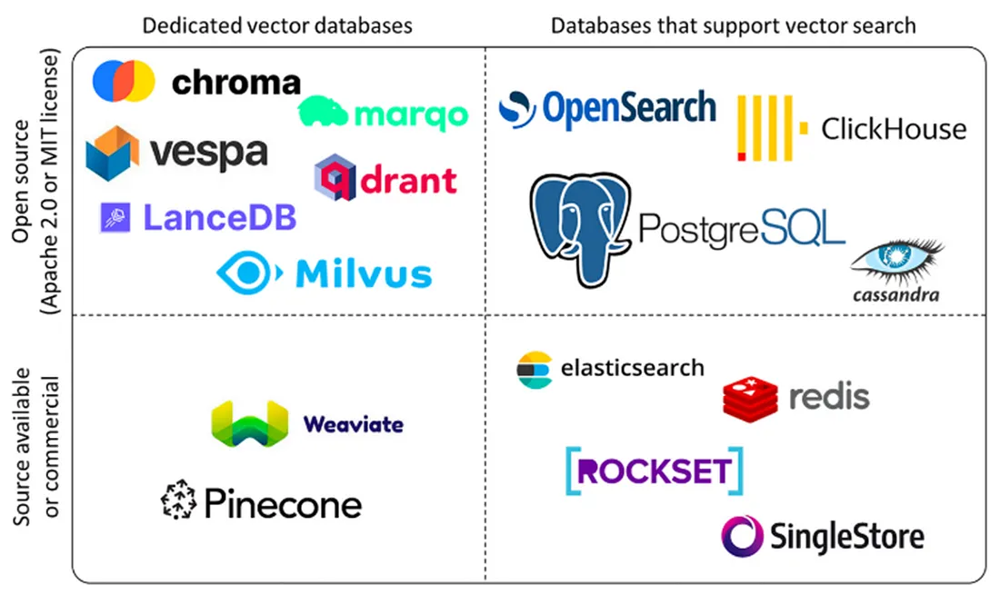
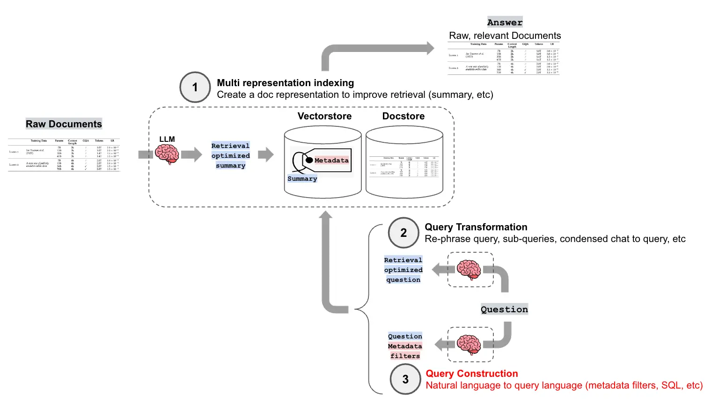

# 总体介绍
## RAG 说明
从本质上讲，RAG（Retrieval-Augmented Generation）是一种旨在解决大语言模型（LLM）“知其然不知其所以然”问题的技术范式。  
它的核心是将模型内部学到的“参数化知识”（模型权重中固化的、模糊的“记忆”），与来自外部知识库的“非参数化知识”（精准、可随时更新的外部数据）相结合。  
其运作逻辑就是在 LLM 生成文本前，先通过检索机制从外部知识库中动态获取相关信息，并将这些“参考资料”融入生成过程，从而提升输出的准确性和时效性。


## 技术原理

(1) 检索阶段：寻找“非参数化知识”

- 知识向量化：嵌入模型（Embedding Model） 充当了“连接器”的角色。它将外部知识库编码为向量索引（Index），存入向量数据库。
- 语义召回：当用户发起查询时，检索模块利用同样的嵌入模型将问题向量化，并通过相似度搜索（Similarity Search），从海量数据中精准锁定与问题最相关的文档片段。

(2) 生成阶段：融合两种知识

- 上下文整合：生成模块接收检索阶段送来的相关文档片段以及用户的原始问题。
- 指令引导生成：该模块会遵循预设的 Prompt 指令，将上下文与问题有效整合，并引导 LLM（如 DeepSeek）进行可控的、有理有据的文本生成。



## 为什么使用 RAG ?
LLM/VLM 问题的解决遵循的顺序是:  
提示词工程（Prompt Engineering）-> 检索增强生成 -> 微调（Fine-tuning）

- 先尝试提示工程：通过精心设计提示词来引导模型，适用于任务简单、模型已有相关知识的场景。
- 再选择 RAG：如果模型缺乏特定或实时知识而无法回答，则使用 RAG，通过外挂知识库为其提供上下文信息。
- 最后考虑微调：当目标是改变模型“如何做”（行为/风格/格式）而不是“知道什么”（知识）时，微调是最终且最合适的选择。例如，让模型学会严格遵循某种独特的输出格式、模仿特定人物的对话风格，或者将极其复杂的指令“蒸馏”进模型权重中。

<div align="center">
<table border="1" style="margin: 0 auto;">
  <tr>
    <th style="text-align: center;">问题</th>
    <th style="text-align: center;">RAG的解决方案</th>
  </tr>
  <tr>
    <td style="text-align: center;"><strong>静态知识局限</strong></td>
    <td style="text-align: center;">实时检索外部知识库，支持动态更新</td>
  </tr>
  <tr>
    <td style="text-align: center;"><strong>幻觉（Hallucination）</strong></td>
    <td style="text-align: center;">基于检索内容生成，错误率降低</td>
  </tr>
  <tr>
    <td style="text-align: center;"><strong>领域专业性不足</strong></td>
    <td style="text-align: center;">引入领域特定知识库（如医疗/法律）</td>
  </tr>
  <tr>
    <td style="text-align: center;"><strong>数据隐私风险</strong></td>
    <td style="text-align: center;">本地化部署知识库，避免敏感数据泄露</td>
  </tr>
</table>
<p><em>RAG 对 LLM 局限的解决方案</em></p>
</div>


## 关键优势
（1）**准确性与可信度的双重提升**

RAG 最核心的价值在于突破了模型预训练知识的限制。它不仅能**补充专业领域的知识盲区**，还能通过提供具体的参考材料，有效**抑制“一本正经胡说八道”的幻觉现象**。论文研究还表明，RAG 生成的内容在**具体性**和**多样性**上也显著优于纯 LLM。更重要的是，RAG 具备**可溯源性**——每一条回答都能找到对应的原始文档出处，这种“有据可查”的特性极大提高了内容在应急、工业等严肃场景下的可信度。

（2）**时效性保障**

在知识更新方面，RAG 解决了 LLM 固有的**知识时滞问题**（即模型不知道训练截止日期之后发生的事）。RAG 允许知识库独立于模型进行**动态更新**——新政策或新数据一旦入库，立刻就能被检索到。这种能力在论文中被称为**“索引热拔插”（Index Hot-swapping）**——就像给机器人换一张存储卡一样，瞬间切换其世界知识库，而无需重新训练模型，实现了知识的实时在线。

（3）**显著的综合成本效益**

从经济角度看，RAG 是一种高性价比的方案。首先，它**避免了高频微调**带来的巨额算力成本；其次，由于有了外部知识的强力辅助，我们在处理特定领域问题时，往往可以使用**参数量更小的基础模型**来达到类似的效果，从而直接降低了推理成本。这种架构也减少了试图将海量知识强行“塞入”模型权重中所需的计算资源消耗。

（4）**灵活的模块化可扩展性**

RAG 的架构具备极强的包容性，支持**多源集成**，无论是 PDF、Word 还是网页数据，都能统一构建进知识库中。同时，其**模块化设计**实现了检索与生成的解耦，这意味着我们可以独立优化检索组件（比如更换更好的 Embedding 模型），而不会影响到生成组件的稳定性，便于系统的长期迭代。


## 实现路径
（1）数据准备与清洗：这是系统的地基。我们需要将 PDF、Word 等多源异构数据标准化，并采用合理的分块策略（如按语义段落切分而非固定字符数），避免信息在切割中支离破碎。

（2）索引构建：将切分好的文本通过嵌入模型转化为向量，并存入数据库。可以在此阶段关联元数据（如来源、页码），这对后续的精确引用很有帮助。

（3）检索策略优化：不要依赖单一的向量搜索。可以采用混合检索（向量+关键词）等方式来提升召回率，并引入重排序模型对检索结果进行二次精选，确保 LLM 看到的都是精华。

（4）生成与提示工程：最后，设计一套清晰的 Prompt 模板，引导 LLM 基于检索到的上下文回答用户问题，并明确要求模型“不知道就说不知道”，防止幻觉。

# 具体实现

## 数据准备
### 数据加载
文档加载器负责将各种格式的非结构化文档（如PDF、Word、Markdown、HTML等）转换为程序可以处理的结构化数据。数据加载的质量会直接影响后续的索引构建、检索效果和最终的生成质量。

<div align="center">
<table border="1" style="margin: 0 auto;">
  <tr>
    <th style="text-align: center;">工具名称</th>
    <th style="text-align: center;">特点</th>
    <th style="text-align: center;">适用场景</th>
    <th style="text-align: center;">性能表现</th>
  </tr>
  <tr>
    <td style="text-align: center;"><strong>PyMuPDF4LLM</strong></td>
    <td style="text-align: center;">PDF→Markdown转换，OCR+表格识别</td>
    <td style="text-align: center;">科研文献、技术手册</td>
    <td style="text-align: center;">开源免费，GPU加速</td>
  </tr>
  <tr>
    <td style="text-align: center;"><strong>TextLoader</strong></td>
    <td style="text-align: center;">基础文本文件加载</td>
    <td style="text-align: center;">纯文本处理</td>
    <td style="text-align: center;">轻量高效</td>
  </tr>
  <tr>
    <td style="text-align: center;"><strong>DirectoryLoader</strong></td>
    <td style="text-align: center;">批量目录文件处理</td>
    <td style="text-align: center;">混合格式文档库</td>
    <td style="text-align: center;">支持多格式扩展</td>
  </tr>
  <tr>
    <td style="text-align: center;"><strong>Unstructured</strong></td>
    <td style="text-align: center;">多格式文档解析</td>
    <td style="text-align: center;">PDF、Word、HTML等</td>
    <td style="text-align: center;">统一接口，智能解析</td>
  </tr>
  <tr>
    <td style="text-align: center;"><strong>FireCrawlLoader</strong></td>
    <td style="text-align: center;">网页内容抓取</td>
    <td style="text-align: center;">在线文档、新闻</td>
    <td style="text-align: center;">实时内容获取</td>
  </tr>
  <tr>
    <td style="text-align: center;"><strong>LlamaParse</strong></td>
    <td style="text-align: center;">深度PDF结构解析</td>
    <td style="text-align: center;">法律合同、学术论文</td>
    <td style="text-align: center;">解析精度高，商业API</td>
  </tr>
  <tr>
    <td style="text-align: center;"><strong>Docling</strong></td>
    <td style="text-align: center;">模块化企业级解析</td>
    <td style="text-align: center;">企业合同、报告</td>
    <td style="text-align: center;">IBM生态兼容</td>
  </tr>
  <tr>
    <td style="text-align: center;"><strong>Marker</strong></td>
    <td style="text-align: center;">PDF→Markdown，GPU加速</td>
    <td style="text-align: center;">科研文献、书籍</td>
    <td style="text-align: center;">专注PDF转换</td>
  </tr>
  <tr>
    <td style="text-align: center;"><strong>MinerU</strong></td>
    <td style="text-align: center;">多模态集成解析</td>
    <td style="text-align: center;">学术文献、财务报表</td>
    <td style="text-align: center;">集成LayoutLMv3+YOLOv8</td>
  </tr>
</table>
<p><em>当前主流 RAG 文档加载器</em></p>
</div>

技术选型和实现:
```
langchain_community.document_loaders
```
```
.pdf  -> PyPDFLoader
.docx -> Docx2txtLoader
.doc  -> Docx2txtLoader
.txt  -> TextLoader
.md   -> TextLoader
.urdf -> TextLoader
.xacro -> TextLoader
```

原因: 1. 实践获得 2. 考虑端侧的资源消耗

### 文本分块
典型文本分块技术: 固定大小分块; 递归字符分块; 语义分块  

具体技术内容不赘述，可自行查询  

技术选型和实现: 基于文档结构的分块

1. 使用 MarkdownHeaderTextSplitter 将文档按标题分割成若干个大的、带有元数据的逻辑块。
2. 对这些逻辑块再应用 RecursiveCharacterTextSplitter，将其进一步切分为符合 chunk_size 要求的小块。由于这个过程是在第一步之后进行的，所有最终生成的小块都会继承来自第一步的标题元数据。

RAG应用优势: 这种两阶段的分块方法，既保留了文档的宏观逻辑结构（通过元数据），又确保了每个块的大小适中，是处理结构化文档进行RAG的理想方案。

劣势: 无论什么文本格式需要先转换为 markdown 处理

## 向量嵌入

### 什么是 Embedding

向量嵌入（Embedding）是一种将真实世界中复杂、高维的数据对象（如文本、图像、音频、视频等）转换为数学上易于处理的、低维、稠密的连续数值向量的技术。

想象一下，我们将每一个词、每一段话、每一张图片都放在一个巨大的多维空间里，并给它一个独一无二的坐标。这个坐标就是一个向量，它“嵌入”了原始数据的所有关键信息。这个过程，就是 Embedding。

- **数据对象**：任何信息，如文本“你好世界”，或一张猫的图片。
- **Embedding 模型**：一个深度学习模型，负责接收数据对象并进行转换。
- **输出向量**：一个固定长度的一维数组，例如 `[0.16, 0.29, -0.88, ...]`。这个向量的维度（长度）通常在几百到几千之间。



### 向量空间的语义表示

Embedding 的真正意义在于，它产生的向量不是随机数值的堆砌，而是对数据**语义**的数学编码。

- **核心原则**：在 Embedding 构建的向量空间中，语义上相似的对象，其对应的向量在空间中的距离会更近；而语义上不相关的对象，它们的向量距离会更远。
- **关键度量**：我们通常使用以下数学方法来衡量向量间的“距离”或“相似度”：
    - **余弦相似度 (Cosine Similarity)** ：计算两个向量夹角的余弦值。值越接近 1，代表方向越一致，语义越相似。这是最常用的度量方式。
    - **点积 (Dot Product)** ：计算两个向量的乘积和。在向量归一化后，点积等价于余弦相似度。
    - **欧氏距离 (Euclidean Distance)** ：计算两个向量在空间中的直线距离。距离越小，语义越相似。

### 在 RAG 中的作用
RAG 的“检索”环节通常以基于 Embedding 的语义搜索为核心。通用流程如下：  
（1）**离线索引构建**：将知识库内文档切分后，使用 Embedding 模型将每个文档块（Chunk）转换为向量，存入专门的向量数据库中。

（2）**在线查询检索**：当用户提出问题时，使用**同一个** Embedding 模型将用户的问题也转换为一个向量。

（3）**相似度计算**：在向量数据库中，计算“问题向量”与所有“文档块向量”的相似度。

（4）**召回上下文**：选取相似度最高的 Top-K 个文档块，作为补充的上下文信息，与原始问题一同送给大语言模型（LLM）生成最终答案。

### 嵌入模型选型



当前使用: 
1. nomic-ai/nomic-embed-text-v2-moe-GGUF:Q4_K_M
2. Qwen/Qwen3-Embedding-0.6B-GGUF
3. Qwen/Qwen3-Embedding-4B-GGUF

说明:
1. 主要针对文本向量(考虑资源消耗问题)
2. 缺乏多模态信息检索能力


### 迭代测试与优化

（1）确定基线 (Baseline) ：根据上述维度，选择几个符合要求的模型作为初始基准模型。

（2）构建私有评测集 ：根据真实业务数据，手动创建一批高质量的评测样本，每个样本包含一个典型用户问题和它对应的标准答案（或最相关的文档块）。

（3）迭代优化 ： 
- 使用基线模型在私有评测集上运行，评估其召回的准确率和相关性。 
- 如果效果不理想，可以尝试更换模型，或者调整 RAG 流程的其他环节（如文本分块策略）。 
- 通过几轮的对比测试和迭代优化，最终选出在特定场景下表现最佳的那个“心仪”模型。


## 向量数据库
向量数据库与传统数据库的主要差异如下：

| **维度** | **向量数据库** | **传统数据库 (RDBMS)** |
| :--- | :--- | :--- |
| **核心数据类型** | 高维向量 (Embeddings) | 结构化数据 (文本、数字、日期) |
| **查询方式** | **相似性搜索** (ANN) | **精确匹配** |
| **索引机制** | HNSW, IVF, LSH 等 ANN 索引 | B-Tree, Hash Index |
| **主要应用场景** | AI 应用、RAG、推荐系统、图像/语音识别 | 业务系统 (ERP, CRM)、金融交易、数据报表 |
| **数据规模** | 轻松应对千亿级向量 | 通常在千万到亿级行数据，更大规模需复杂分库分表 |
| **性能特点** | 高维数据检索性能极高，计算密集型 | 结构化数据查询快，高维数据查询性能呈指数级下降 |
| **一致性** | 通常为最终一致性 | 强一致性 (ACID 事务) |



这是一个工程技术实现问题，不赘述  

考虑端侧特点和需要，基于 FAISS 实现:
1. 性能要求相较其他偏低
2. 在数据量未达到百万级或不需要高并发的情况下，性能优越


## 检索优化

### 混合检索

混合检索（Hybrid Search）是一种结合了 **稀疏向量（Sparse Vectors）** 和 **密集向量（Dense Vectors）** 优势的先进搜索技术。旨在同时利用稀疏向量的关键词精确匹配能力和密集向量的语义理解能力，以克服单一向量检索的局限性，从而在各种搜索场景下提供更准确、更鲁棒的检索结果。  

待实现。

### 查询构建
利用大语言模型（LLM）的强大理解能力，将用户的自然语言查询“翻译”成针对特定数据源的结构化查询语言或带有过滤条件的请求。这使得RAG系统能够无缝地连接和利用各种类型的数据，从而极大地扩展了其应用场景和能力。  




在构建向量索引时，常常会为文档块（Chunks）附加元数据（Metadata），例如文档来源、发布日期、作者、章节、类别等。这些元数据为我们提供了在语义搜索之外进行精确过滤的可能。

**自查询检索器** 是实现这一功能的核心组件。它的工作流程如下：

1.  **定义元数据结构**：首先，需要向LLM清晰地描述文档内容和每个元数据字段的含义及类型。
2.  **查询解析**：当用户输入一个自然语言查询时，自查询检索器会调用LLM，将查询分解为两部分：
    *   **查询字符串（Query String）**：用于进行语义搜索的部分。
    *   **元数据过滤器（Metadata Filter）**：从查询中提取出的结构化过滤条件。
3.  **执行查询**：检索器将解析出的查询字符串和元数据过滤器发送给向量数据库，执行一次同时包含语义搜索和元数据过滤的查询。

例如，对于查询“关于2022年发布的机器学习的论文”，自查询检索器会将其解析为：
*   **查询字符串**: "机器学习的论文"
*   **元数据过滤器**: `year == 2022`

### 查询路由和分发
用户的原始问题往往不是最优的检索输入。它可能过于复杂、包含歧义，或者与文档的实际措辞存在偏差。为了解决这些问题，可以在检索之前对用户的查询进行“预处理”。

主要包含两个关键技术：
1. 查询翻译（Query Translation）：将用户的原始问题转换成一个或多个更适合检索的形式。
2. 查询路由（Query Routing）：根据问题的性质，将其智能地分发到最合适的数据源或检索器。  

待实现。

